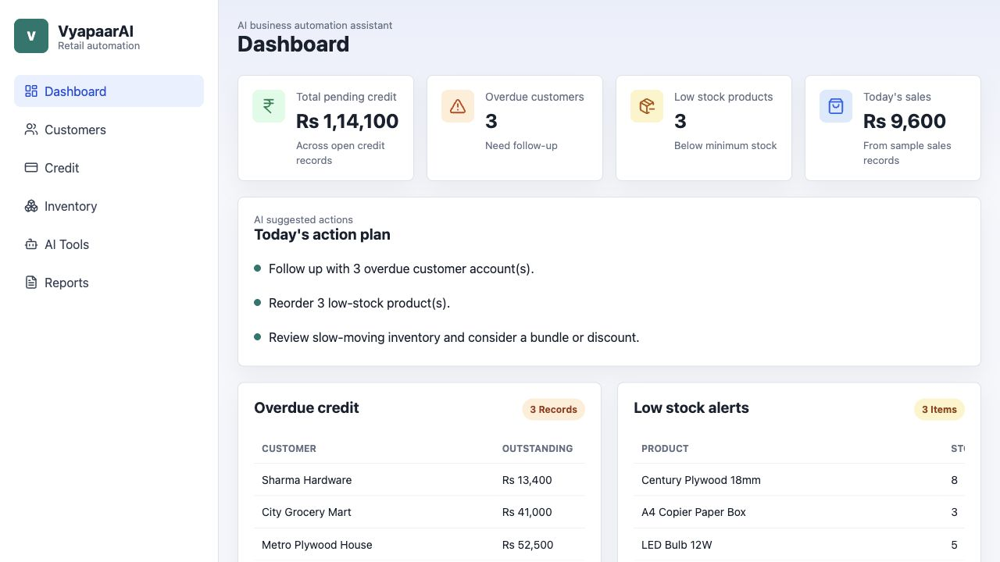

# Vyapaar - AI Business Automation Assistant for Small Retailers

Vyapaar is a full-stack retail automation dashboard for small shopkeepers, retailers, wholesalers, grocery shops, stationery shops, hardware shops, plywood shops, and local businesses.

It helps owners manage customer credit, generate WhatsApp payment reminders, analyze customer risk, track inventory, detect low stock and dead stock, and generate practical business summaries using AI.

## Features

- Dashboard with pending credit, overdue customers, low stock products, today's sales, and suggested actions.
- Customer management with add, edit, search, and profile view.
- Credit tracker with due amount, paid amount, due date, status, reminders sent, overdue detection, and payment update.
- Customer-wise credit ledger with dated payment history, customer totals, filters, and collection notes.
- Automation Center with follow-up queue, reorder queue, daily playbook, and smart retail rules.
- AI WhatsApp reminder generator with tone and language options.
- Customer risk analyzer with Low, Medium, and High risk levels.
- Inventory management with low-stock and slow-moving item detection.
- AI business assistant that answers questions from available business data.
- Daily, monthly, pending credit, and inventory reports.
- SQLite seed data for quick demos.

## Tech Stack

- Frontend: React, Vite, CSS, lucide-react icons
- Backend: FastAPI, SQLAlchemy, Pydantic
- Database: SQLite for local development
- AI: Local fallback mode, OpenAI Responses API option, Gemini API option

## Folder Structure

```text
Vyapaar/
  backend/
    app/
      core/config.py
      routers/
        ai.py
        automation.py
        credits.py
        customers.py
        dashboard.py
        inventory.py
        reports.py
        sales.py
      services/
        ai_service.py
        analytics.py
      database.py
      main.py
      models.py
      schemas.py
      seed.py
    requirements.txt
  frontend/
    src/
      api/client.js
      components/
      pages/
      styles/index.css
      App.jsx
      main.jsx
    package.json
    vite.config.js
  docs/
    API_ENDPOINTS.md
    AI_PROMPTS.md
    BUILD_PLAN.md
    DATABASE_SCHEMA.md
    FRONTEND_STRUCTURE.md
    RESUME_BULLETS.md
    SAMPLE_DATA.md
  .env.example
  .gitignore
  README.md
```

## Run Locally

### 1. Backend

```bash
cd "/Users/rohitagarwal/Desktop/Vyapaar AI/backend"
python3 -m venv .venv
source .venv/bin/activate
pip install -r requirements.txt
cp ../.env.example .env
python -m uvicorn app.main:app --reload
```

Backend runs at:

```text
http://localhost:8000
```

API docs:

```text
http://localhost:8000/docs
```

### 2. Frontend

Open a second terminal:

```bash
cd "/Users/rohitagarwal/Desktop/Vyapaar AI/frontend"
npm install
npm run dev
```

Frontend runs at:

```text
http://localhost:5173
```

## AI Setup

The app runs without paid AI keys using `AI_PROVIDER=local`. That mode generates reminders, risk scores, and assistant responses with deterministic business logic.

To use OpenAI:

```env
AI_PROVIDER=openai
OPENAI_API_KEY=your_key_here
OPENAI_MODEL=gpt-4.1-mini
```

To use Gemini:

```env
AI_PROVIDER=gemini
GEMINI_API_KEY=your_key_here
GEMINI_MODEL=gemini-2.0-flash
```

## Build Phases

Phase 1 includes dashboard, customers, credit tracker, inventory, SQLite schema, and seed data.

Phase 2 includes AI WhatsApp reminders and customer risk analyzer.

Phase 3 includes AI business assistant and reports.

Phase 4 includes UI polish, deployment preparation, README, and demo screenshots.

## API Summary

- `GET /api/dashboard/summary`
- `GET /api/automation/plan`
- `GET /api/customers`
- `POST /api/customers`
- `PUT /api/customers/{customer_id}`
- `GET /api/credits`
- `POST /api/credits`
- `PATCH /api/credits/{record_id}/payment`
- `POST /api/credits/{record_id}/payments`
- `POST /api/credits/{record_id}/reminder-sent`
- `GET /api/inventory/products`
- `POST /api/inventory/products`
- `GET /api/inventory/low-stock`
- `GET /api/inventory/dead-stock`
- `POST /api/ai/reminder`
- `GET /api/ai/risk/customer/{customer_id}`
- `POST /api/ai/business-assistant`
- `GET /api/reports/daily`
- `GET /api/reports/monthly`
- `GET /api/reports/pending-credit`
- `GET /api/reports/inventory`

## Demo Data

The backend seeds sample customers, credit records, products, and sales on first startup. Delete `backend/vyapaarai.db` to regenerate fresh sample data.

## Demo Screenshot



## Deployment Notes

- Use PostgreSQL for production instead of SQLite.
- Move secrets into environment variables.
- Add authentication before using with real customer data.
- Use HTTPS and restrict CORS origins.
- Add automated tests before production release.
